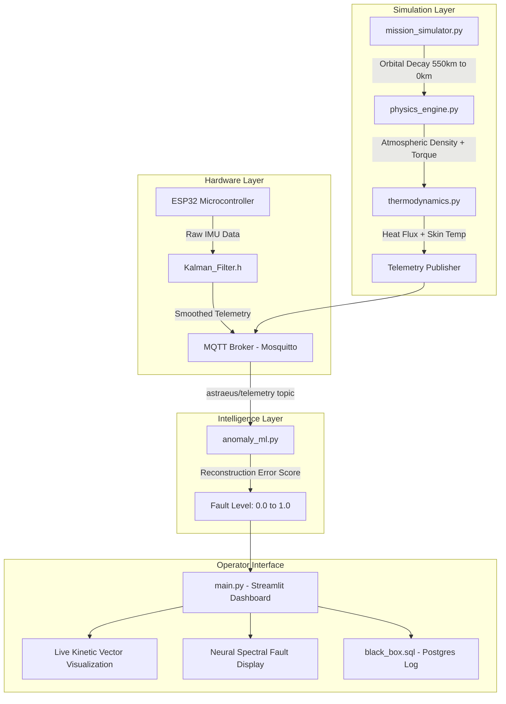

# 🚀 Astraeus-9-C-C: Hybrid Orbital Re-Entry Mission Control

<div align="center">

[](https://python.org)
[](https://www.arduino.cc/)
[](https://docker.com)
[](https://streamlit.io)
[](LICENSE)

**Astraeus-9** is a fault-tolerant mission control system for orbital re-entry monitoring. It integrates an ESP32 embedded sensing kernel with Kalman filtering, a physics-based re-entry simulator, and an ML-powered anomaly detection dashboard to achieve real-time hardware degradation detection.

</div>

---

## ⚡ The Problem: Re-Entry Hardware Degradation

During orbital re-entry, spacecraft experience extreme conditions:
- **Radiation damage** from cosmic ray bit-flips corrupting sensor data
- **Thermal stress** from atmospheric friction causing sensor drift
- **Structural vibration** as atmospheric drag increases with decreasing altitude
- Legacy systems cannot detect these failures in real-time before they become catastrophic

---

## 🚀 The Solution: Astraeus-9

Astraeus-9 uses a **three-technology hybrid approach**:

1. **Embedded Sensing Kernel** (ESP32 + Kalman Filter) — real hardware state estimation
2. **Physics-Driven Simulation** — atmospheric drag, thermal flux, orbital decay modeling
3. **ML Anomaly Detection** — MLP autoencoder for reconstruction-error fault scoring

---

## 🏗️ System Architecture



---

## 👤 My Contributions (Rhutvik Pachghare)

**Lead Engineer: Robotics & GNC Domain**

| Component | My Work |
|---|---|
| **Embedded Kernel** | Programmed the ESP32 firmware (`Astraeus_Kernel.ino`) with SpatialKalman filter integration for 6-DOF telemetry smoothing and MQTT WiFi transmission |
| **Mission Simulator** | Built `mission_simulator.py` — models orbital decay from 550km LEO with atmospheric drag physics and cosmic ray bit-flip anomaly injection |
| **Physics Engine** | Implemented `physics_engine.py` and `thermodynamics.py` — computing atmospheric density, orbital torque, re-entry heat flux, and skin temperature estimates |
| **Infrastructure** | Designed the Docker Compose stack connecting Mosquitto MQTT broker, Postgres, and Streamlit dashboard |

---

## 📂 Repository Structure

```
Astraeus-9-C-C/
├── Astraeus_Kernel.ino      # ESP32 embedded firmware with SpatialKalman filter
├── Kalman_Filter.h          # Custom Kalman filter header for ESP32
├── mission_simulator.py     # Orbital decay physics simulator (550km → impact)
├── physics_engine.py        # Atmospheric density and orbital torque calculator
├── thermodynamics.py        # Re-entry heat flux and skin temperature model
├── anomaly_ml.py            # MLP Autoencoder for hardware fault detection
├── main.py                  # Streamlit Mission Control Dashboard
├── black_box.sql            # Postgres schema for mission-critical telemetry logs
├── style.css                # Custom dark mode dashboard styling
├── Dockerfile               # Container configuration
└── docker-compose.yml       # Multi-service orchestration
```

---

## ⚙️ Physics & Simulation

### Orbital Decay Model
```python
# Atmospheric drag increases exponentially as altitude decreases
rho = rho_0 * np.exp(-altitude / H_scale)  # Atmospheric density
a_drag = 0.5 * Cd * A * rho * v**2 / m     # Drag deceleration

# Cosmic Ray Bit-Flip Injection
radiation_exposure = integrate(flux, dt=time_in_LEO)
if random() < radiation_probability(radiation_exposure):
    sensor_data ^= (1 << random_bit)  # Bit-flip fault injection
```

### Re-Entry Thermal Model
```python
# Stagnation heat flux (W/m²)
q_stagnation = 0.5 * rho * v**3 * Cd / nose_radius

# Skin temperature from energy balance
dT_skin = (q_stagnation - epsilon * sigma * T_skin**4) / (rho_wall * cp * thickness)
```

---

## 🧠 ML Anomaly Detection

**`anomaly_ml.py`** uses an MLP Autoencoder trained on nominal telemetry data:

```
Telemetry Input [N features]
    │
    ▼
Encoder: Linear(N → 32) + ReLU + Linear(32 → 8) + ReLU
    │
    ▼
Bottleneck: 8-dim latent space
    │
    ▼
Decoder: Linear(8 → 32) + ReLU + Linear(32 → N)
    │
    ▼
Reconstruction Error Score
    │
    ▼
Fault Level: 0.0 (Healthy) → 1.0 (Critical)
```

---

## 🚀 Quick Start

### Prerequisites
- Docker & Docker Compose
- Python 3.9+ (for local simulation)
- Arduino IDE (for ESP32 firmware flashing)

### 1. Initialize Services
```bash
git clone https://github.com/Rhutvik-pachghare1999/Astraeus-9-C-C.git
cd Astraeus-9-C-C
bash setup.sh
# Launches: Mosquitto Broker, Postgres DB, Streamlit Dashboard
```

### 2. Launch Orbital Simulation
```bash
python mission_simulator.py
# Publishes real-time telemetry to astraeus/telemetry MQTT topic
```

### 3. Flash ESP32 Hardware (Optional)
1. Open `Astraeus_Kernel.ino` in Arduino IDE
2. Install libraries: `PubSubClient`, `WiFi`, `MPU6050`
3. Update WiFi credentials and MQTT broker IP
4. Flash to ESP32 board

### 4. Access Dashboard
Navigate to [http://localhost:8501](http://localhost:8501)

---

## 📊 Dashboard Features

| Page | Description |
|---|---|
| **Live Telemetry** | Real-time kinetic vector visualization (altitude, velocity, acceleration) |
| **Anomaly Diagnostics** | Neural spectral analysis with fault severity color coding |
| **Thermal Monitor** | Re-entry heat flux and skin temperature timeline |
| **Mission Log** | Searchable Postgres `mission_logs` table with all recorded events |

---

## 📦 Dependencies

```bash
pip install streamlit numpy scikit-learn paho-mqtt plotly scipy psycopg2-binary
```

**Services (Docker Compose):**
- `eclipse-mosquitto` — MQTT broker for telemetry stream
- `postgres:latest` — Mission telemetry database
- Streamlit dashboard — Operator interface

---

## 📜 License

MIT License — see [LICENSE](LICENSE) for details.

---

## 👥 Team

| Name | Role | Contributions |
|---|---|---|
| **Rhutvik Pachghare** | Robotics & GNC Lead | ESP32 embedded kernel, Kalman filter, mission simulator, physics & thermal engines, Docker infrastructure |
| **Pooja Kiran** | ML & Data Lead | MLP Autoencoder anomaly detection, Postgres schema, Streamlit dashboard ML integration |

---

## 👤 Author

**Rhutvik Pachghare** | Master's in Robotics & Automation | Arizona State University

[](https://github.com/Rhutvik-pachghare1999)
[](https://www.linkedin.com/in/rhutvik-pachghare/)
